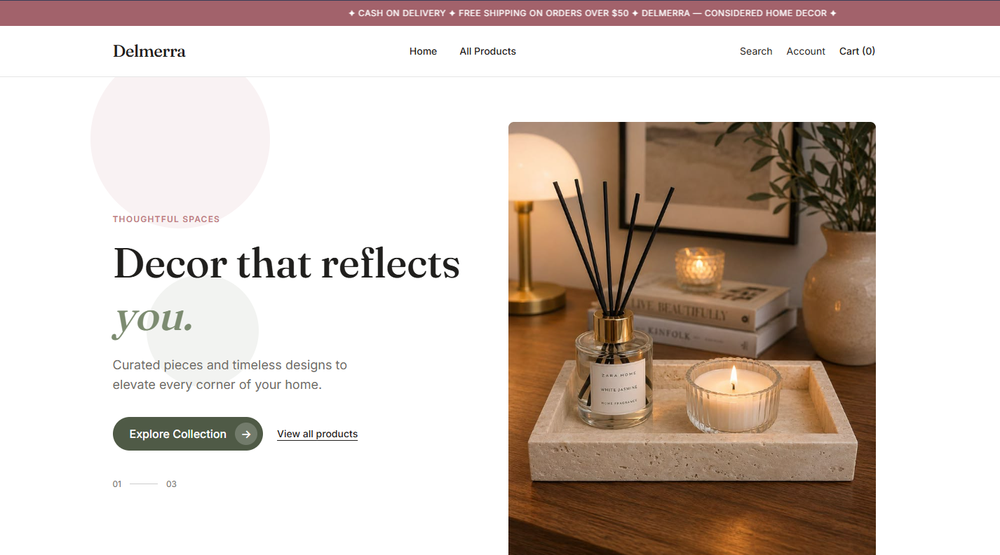
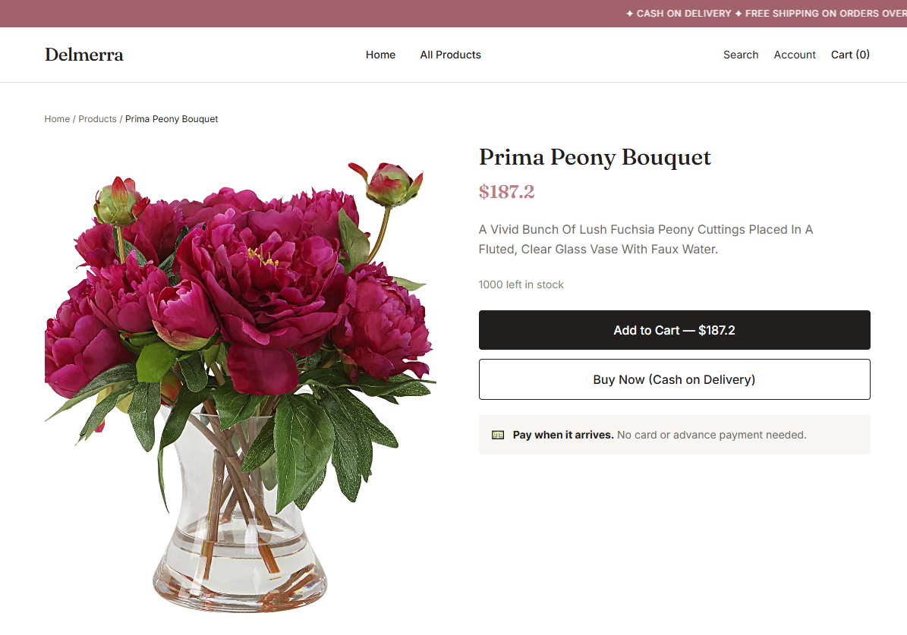
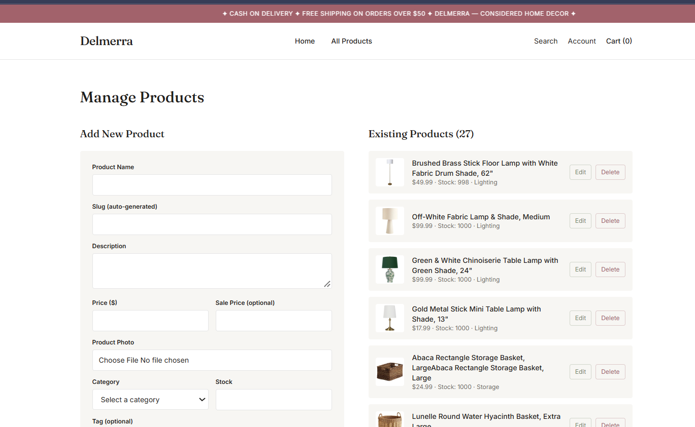

# Delmerra 

A full-stack e-commerce platform for home decor, built end to end as a freelance project for a client.

**Live:** [www.delmerra.com](https://www.delmerra.com)



## Features

- **Storefront:** custom Next.js + Tailwind UI, category-based browsing, interactive product carousel, fully responsive
- **Atomic stock reservation:** prevents overselling when multiple customers check out at the same time
- **Checkout:** cash-on-delivery order flow with order status tracking
- **Admin dashboard:** authenticated CRUD for products, image uploads, and order fulfillment tracking
- **Image pipeline:** product images stored and served through Cloudinary
- **Design system:** custom visual identity and components, designed from scratch

## Tech Stack

| Layer | Tech |
| --- | --- |
| Frontend | Next.js, Tailwind CSS |
| Backend | Node.js, Express (REST API) |
| Database | MongoDB Atlas |
| Media | Cloudinary |
| Hosting | Vercel (frontend), Render (backend), custom domain |

## Screenshots

| Storefront | Product page | Admin dashboard |
| --- | --- | --- |
|  |  |  |

## Project Structure

```
├── frontend/   # Next.js storefront and admin UI
└── backend/    # Express API
```

## Author

**Malaika Irfan**, Software Engineering student & full-stack developer
[GitHub](https://github.com/MalaikaIrfan1)
